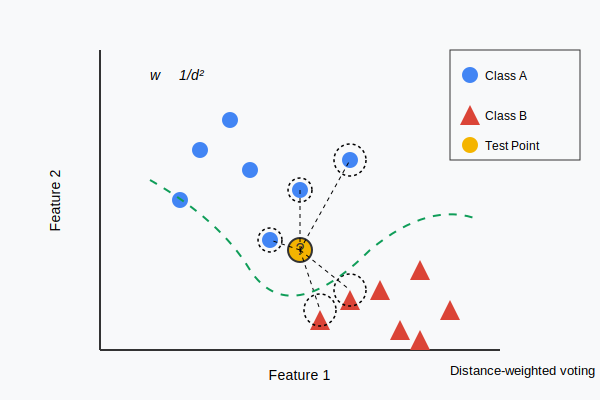

# K-Nearest Neighbors from Scratch

This implementation provides a custom weighted K-Nearest Neighbors (KNN) classification algorithm with inverse square distance weighting and cross-validation functionality.

## Mathematical Formulation

### Algorithm Fundamentals

1. **Euclidean Distance:**
   $$d(x_i, x_j) = \sqrt{\sum_{k=1}^n (x_{i,k} - x_{j,k})^2}$$

2. **Weighted Classification Rule:**
   For a test point $x$, the prediction is:
   $$\hat{y}(x) = \arg\max_{c \in C} \sum_{i \in N_k(x)} \frac{1}{d(x, x_i)^2} \cdot \mathbb{1}(y_i = c)$$

   Where:

   - $N_k(x)$: set of $k$ nearest neighbors to $x$
   - $C$: set of all classes
   - $\mathbb{1}(y_i = c)$: indicator function (1 if $y_i = c$, 0 otherwise)

3. **Cross-Validation Accuracy:**
   $$A = \frac{1}{F} \sum_{i=1}^F \frac{\text{correct predictions in fold } i}{\text{total predictions in fold } i}$$

   Where $F$ is the number of folds.

## KNN Visualization



The diagram illustrates the KNN classification process:

- Blue circles represent Class A data points
- Red triangles represent Class B data points
- Yellow circle with "?" is the test point to be classified
- Dashed lines connect to the 5 nearest neighbors
- The test point is classified based on weighted votes (w ∝ 1/d²) from these neighbors

## Requirements

```
numpy==1.24.3
pandas==2.2.0
matplotlib==3.8.2
seaborn==0.13.0
scikit-learn==1.3.2  # Used only for preprocessing and PCA
```

## Usage

```
python3 knn_implementation.py
```

## Performance Analysis

The weighted voting scheme ($1/d^2$) gives more influence to closer neighbors, improving boundary performance compared to simple majority voting. Feature preprocessing (PCA, StandardScaler) significantly improves accuracy by transforming the feature space to enhance distance calculations.
