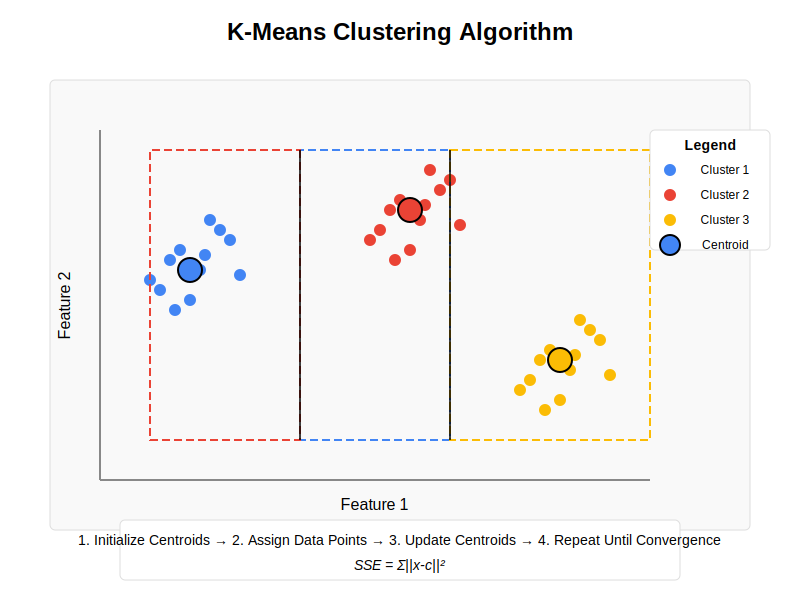

# K-Means Clustering from Scratch

This implementation provides a custom K-Means clustering algorithm with additional optimizations including mini-batch processing, multiple initialization strategies, and distance metrics.

## Mathematical Formulation

### Algorithm Fundamentals

1. **Centroid Initialization:**

   - Random: $C = \{x_i \mid x_i \in X, i \sim \text{Uniform}(1,n)\}$
   - K-means++: Select first centroid randomly, then for each subsequent centroid:
     $$p(x) = \frac{D(x)^2}{\sum_{x' \in X} D(x')^2}$$
     where $D(x)$ is the distance to the nearest existing centroid

2. **Distance Calculation:**

   - Euclidean: $d(x_i, c_j) = \sqrt{\sum_{k=1}^d (x_{i,k} - c_{j,k})^2}$
   - Cosine: $d(x_i, c_j) = 1 - \frac{x_i \cdot c_j}{||x_i|| \cdot ||c_j||}$

3. **Assignment Step:**
   $$z_i = \arg\min_{j} d(x_i, c_j)$$

4. **Update Step:**
   $$c_j = \frac{1}{|S_j|} \sum_{x_i \in S_j} x_i$$
   where $S_j$ is the set of points assigned to cluster $j$

5. **Convergence Criterion:**
   $$\max_{j} ||c_j^{(t)} - c_j^{(t-1)}|| < \epsilon$$

6. **Objective Function (SSE):**
   $$\text{SSE} = \sum_{i=1}^n \sum_{j=1}^k z_{ij} ||x_i - c_j||^2$$
   where $z_{ij} = 1$ if point $i$ belongs to cluster $j$, 0 otherwise

## K-Means Visualization



The diagram illustrates the K-Means clustering process:

- Different colored points represent data samples
- Larger colored circles represent cluster centroids
- Arrows show the movement of centroids during iterations
- Colored regions represent the decision boundaries between clusters
- The algorithm converges when centroids stabilize

## Implementation Features

- **Mini-batch processing** for improved scalability with large datasets
- **Multiple initialization strategies** (random and k-means++)
- **Multiple distance metrics** (Euclidean and cosine)
- **Multiple runs** with different initializations to avoid local minima
- **Early stopping** based on centroid convergence

## Experimental Results

For the image clustering task:

- Dimensionality reduction: SVD → PCA → t-SNE pipeline
- Best number of clusters determined using elbow method
- Final t-SNE visualization shows clear cluster separation

## Requirements

```
numpy==1.24.3
pandas==2.2.0
matplotlib==3.8.2
scikit-learn==1.3.2
```

## Usage

```
python K-means.py
```

## Performance Analysis

The custom K-means implementation provides several advantages over standard implementations:

1. **Robustness:** Multiple runs with different initializations avoid poor local minima
2. **Scalability:** Mini-batch processing enables efficient clustering of large datasets
3. **Flexibility:** Support for different distance metrics accommodates various data types
4. **Convergence control:** Custom threshold parameters allow fine-tuning of performance
